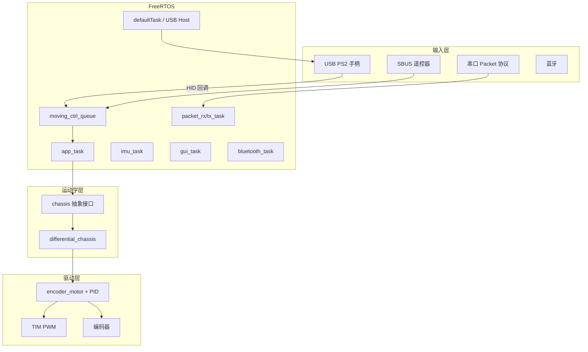

# 03 - 软件架构

## 3.1 系统分层架构



---

## 3.2 FreeRTOS 任务一览

任务在 `Core/Src/freertos.c` 的 `MX_FREERTOS_Init()` 中创建。CubeMX 将部分任务标记为 **As weak**，实际实现覆盖在 `Hiwonder/` 对应文件中。

| 任务名 | 优先级 | 栈(字) | 入口函数 | 实现位置 | 职责 |
|--------|--------|--------|----------|----------|------|
| `defaultTask` | Low | 128 | `StartDefaultTask` | `freertos.c` | 调用 `MX_USB_HOST_Init()` |
| `imu_task` | AboveNormal | 128 | `imu_task_entry` | `Portings/imu_porting.c` | IMU 采样与姿态（`ENABLE_IMU`） |
| `packet_tx_task` | Normal | 128 | `packet_tx_task_entry` | `Portings/packet_porting.c` ※ | 协议帧发送 |
| `packet_rx_task` | Normal | 256 | `packet_rx_task_entry` | `freertos.c` weak 桩 ※ | 协议帧接收 |
| `sbus_rx_task` | Normal | 128 | `sbus_rx_task_entry` | `freertos.c` weak / `sbus_porting` ※ | SBUS 解析 |
| `gui_task` | BelowNormal | 512 | `gui_task_entry` | `System/gui_handle.c` | LVGL 刷新（`ENABLE_LVGL`） |
| `app_task` | Normal | 512 | `app_task_entry` | `System/app.c` | **主控制逻辑** |
| `bluetooth_task` | Normal | 128 | `bluetooth_task_entry` | `Portings/bluetooth_porting.c` | 蓝牙通信 |

> ※ 当前 Keil 链接结果显示 `packet_rx_task_entry1` / `packet_tx_task_entry1` 未被链接，任务使用 `freertos.c` 中的 weak 空实现。若需启用完整串口协议任务，需将 `packet_porting.c` 中函数名与任务入口对齐或去掉 weak 桩。

### 定时器（Software Timer）

| 定时器 | 周期宏 | 回调 | 说明 |
|--------|--------|------|------|
| `button_timer` | 30ms | `button_timer_callback` | 按键扫描 |
| `led_timer` | 30ms | `led_timer_callback` | LED 刷新 |
| `buzzer_timer` | 30ms | `buzzer_timer_callback` | 蜂鸣器 PWM 音调 |
| `battery_check_timer` | 50ms | `battery_check_timer_callback` | 电池电压 |
| `lvgl_timer` | — | `lvgl_timer_callback` | LVGL tick（配合 `lv_tick_inc`） |

### 消息队列

| 队列 | 元素 | 用途 |
|------|------|------|
| `moving_ctrl_queue` | `char` | 手柄/遥控 → `app_task` 运动指令 |
| `packet_tx_queue` | `void*` | 待发送协议帧指针 |
| `lvgl_event_queue` | `void*` | GUI 事件 |
| `bluetooth_tx_queue` | 8 字节 | 蓝牙发送缓冲 |

### 信号量 / 事件

- `packet_tx_idle`、`packet_rx_not_empty` — 串口 DMA 同步
- `IMU_data_ready` — IMU 数据就绪
- `bluetooth_tx_idle` — 蓝牙发送空闲
- `serial_servo_rx_complete` — 总线舵机应答
- `sbus_data_ready_event_` — SBUS 事件标志

---

## 3.3 PS2 手柄控制数据流

```
USB 插入 PS2 手柄
    → defaultTask 初始化 USB Host
    → HID 驱动枚举设备
    → USBH_HID_EventCallback()  [gampad_handle.c]
        → 解析摇杆/按键 → 字符命令 ('A'~'H', 'I', 'j', 'S'...)
        → osMessageQueuePut(moving_ctrl_queue, ...)
    → app_task_entry() 循环
        → osMessageQueueGet(..., 100ms 超时)
        → ti4wd_control(msg)  [app.c]
            → chassis->set_velocity() / set_velocity_radius() / stop()
            → pwm_servo_set_position()（云台）
```

### 控制字符映射（节选）

| 字符 | 含义 |
|------|------|
| `I` | 摇杆回中 / 停止 |
| `A`~`H` | 左摇杆八方向（含斜向圆弧运动） |
| `J`~`Q` | 右摇杆八方向（云台舵机） |
| `S` | Start — 连接提示音 |
| `j` / `n` | 三角 / 叉 — 加速 / 减速 |
| `l` / `p` | 方 / 圆 — 横移（麦克纳姆；履带车效果视底盘而定） |

超时 100ms 未收到新指令时，`app_task` 调用 `chassis->stop()` 实现 **失联停车**。

---

## 3.4 底盘抽象设计

`ChassisTypeDef` 提供多态接口：

```c
typedef struct {
    ChassisTypeEnum chassis_type;
    void (*set_velocity)(void *self, float vx, float vy, float angular_rate);
    void (*set_velocity_radius)(void *self, float linear, float r, bool insitu);
    void (*stop)(void *self);
} ChassisTypeDef;
```

`chassis_porting.c` 中实例化：

- `jetank`、`tank_black`、`ti4wd` → `DifferentialChassisTypeDef`
- `jetauto` → `MecanumChassisTypeDef`
- `jetacker` → `AckermannChassisTypeDef`

全局指针 `chassis` 由 `set_chassis_type()` 切换。履带车使用 `tank_black`，电机映射：

```c
// 左履带：motor[0] 反向；右履带：motor[1] 正向
encoder_motor_set_speed(motors[0], -rps_l);
encoder_motor_set_speed(motors[1], rps_r);
```

机械参数（轮径、轮距）定义在 `chassis.h` 的 `TANKBLACK_*` 宏中。

---

## 3.5 串口通信协议

帧结构（`Hiwonder/Misc/packet.h`）：

```
| 0xAA | 0x55 | Function | Length | Data... | Checksum |
```

功能码 `PACKET_FUNCTION`：

| 值 | 名称 | 说明 |
|----|------|------|
| 0 | SYS | 系统 |
| 1 | LED | 灯 |
| 2 | BUZZER | 蜂鸣器 |
| 3 | MOTOR | 电机 |
| 4 | PWM_SERVO | PWM 舵机 |
| 5 | BUS_SERVO | 总线舵机 |
| 6 | KEY | 按键 |
| 7 | IMU | 惯性单元 |
| 8 | GAMEPAD | 手柄状态 |
| 9 | SBUS | 遥控器 |

解析器 `PacketController` 使用状态机 + DMA 双缓冲接收，详见 `packet_porting.c` 的 `packet_init()`。

---

## 3.6 全局配置宏

文件：`Hiwonder/System/global_conf.h`

| 宏 | 默认值 | 说明 |
|----|--------|------|
| `ENABLE_DEBUG_UART` | 1 | 1=串口日志，0=JLink RTT |
| `ENABLE_IMU` | 1 | IMU 任务 |
| `ENABLE_LVGL` | 0 | LVGL 界面任务 |
| `ENABLE_BLUETOOTH` | 1 | 蓝牙 |
| `ENABLE_BLUETOOTH_BATTERY_REPORT` | 1 | 蓝牙上报电压 |
| `ENABLE_BATTERY_LOW_ALARM` | 0 | 低电压蜂鸣报警 |
| `BATTERY_LOW_ALARM_THRESHOLD` | 6300 | 报警阈值 (mV) |

---

## 3.7 内存管理

- `main()` 中调用 `lwmem_assignmem(lwmem_regions)` 初始化 **LwMEM** 动态内存池
- 协议接收 FIFO、DMA 缓冲等可在池中分配
- 配置见 `Hiwonder/Portings/lwmem_porting.c`

---

## 3.8 显示子系统

两套 UI 方案并存，由宏与编译选项选择：

| 方案 | 目录 | 特点 |
|------|------|------|
| LVGL | `Hiwonder/LVGL_UI/` + `Third_Party/LVGL/` | 丰富界面，资源占用大 |
| U8g2 | `Portings/u8g2_porting.c` + `Third_Party/U8g2/` | 轻量单色图形 |

`vApplicationTickHook()` 中调用 `lv_tick_inc(1)` 驱动 LVGL 时基。

---

## 3.9 启动时序

```
main()
  ├─ LOG_INIT(), lwmem_assignmem()
  ├─ HAL_Init(), SystemClock_Config()
  ├─ MX_GPIO_Init(), MX_DMA_Init(), MX_USART*, MX_TIM*, ...
  ├─ MX_FREERTOS_Init()    // 创建任务、队列、定时器
  └─ osKernelStart()       // 开始调度

调度开始后：
  defaultTask → MX_USB_HOST_Init()
  app_task    → motors_init(), chassis_init(), 控制循环
  其他任务    → 按各自 porting 初始化
```
